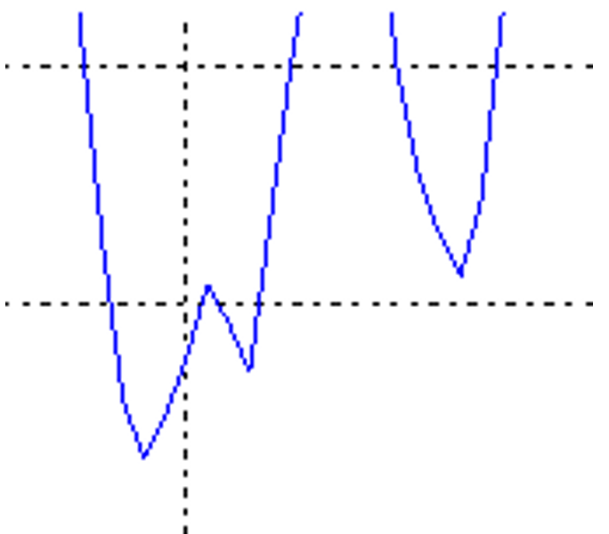
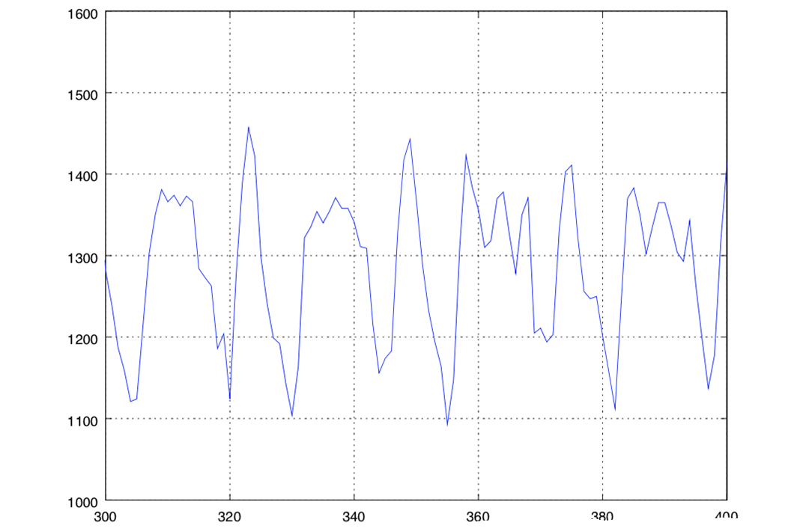

# ディジタル万歩計 Digital Pedometer
## 構想と経過報告  - 2017/11/29
# 7班
- 154-T6901 早﨑 悠登
- 151-T6908 平松 将
- 150-T6909 廣松 大祐
- 151-T6942 山崎 雄喜

---

# 目標
以下の目標について精度80%の正確さを目指す
1. 歩行をカウント
2. 走行をカウント
3. 階段の登り降りをカウント
4. 歩行以外(手で振るなど)をカウントしない

---

# 方針
1. 歩行データから規則性を調べる

	1. データをとる
	1. 平滑する (n点平均をとる)
	1. 歩数をカウント出来る特徴を見つける

1. 歩数をカウント出来る特徴を取り出すプログラムを作成する

1. 調整

---

# 開発計画

1. 歩行データをArduinoで取得し、歩行時のデータ的特徴を読み取る

1. データを元にPCでプログラムを作成

	1. 適切な長さの配列にデータを格納
	1. 平滑化処理
    1. カウントする

1. Arduinoに移植

1. 走行、階段の昇降についても1~4を繰り返す

1. ( 追加機能 )
	1. 画面表示
	1. リセットボタン
	1. 消費カロリー
	1. 検知した足踏みに合わせて音を鳴らす

---
# 開発進捗
1. 歩行データを取得しスペクトル解析をすることで、
歩行時特有の特徴を調べようと計画した。

1. しかし、計算量が多くなりそうなのでやめた。

1. 別の方法として、歩行データの時間グラフの極小値をカウントすることにした。ただし、極小の点から2~3点連続して上昇した時のみカウントする。

---

# 参考図

---

# 達成度

---

# 現在の課題
* 何msごとにデータを取り、何点平均で平滑化するのが適切かを見極めること
* 歩行時と体が揺れただけの時を区別すること
* 歩行と走行を区別すること

 ---

 # ご静聴ありがとうございました

---
# 参考資料
歩行中の生のデータ

---

# 参考資料
歩行中のデータにLPFをかけたもの

