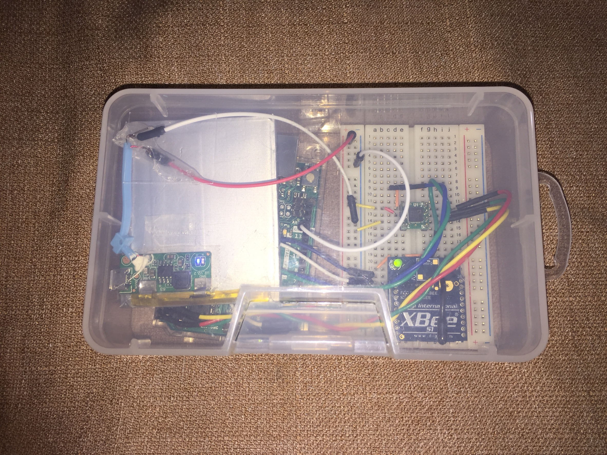
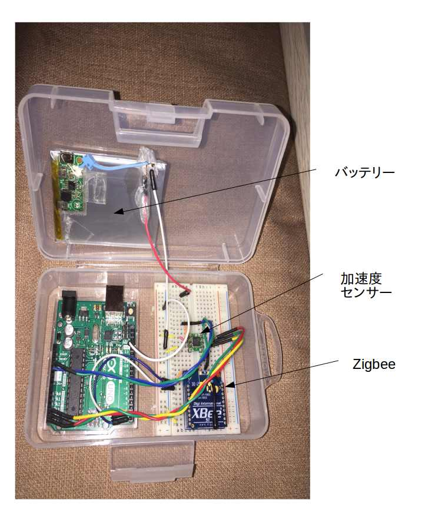
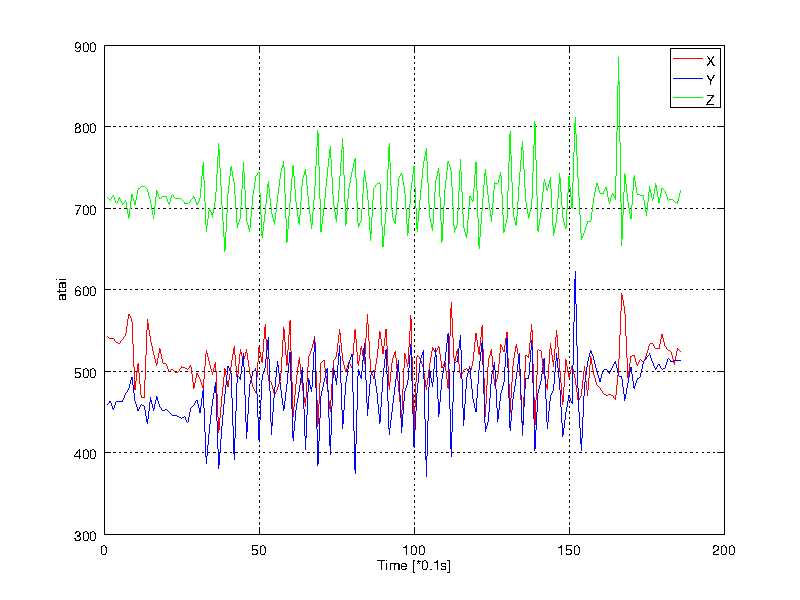
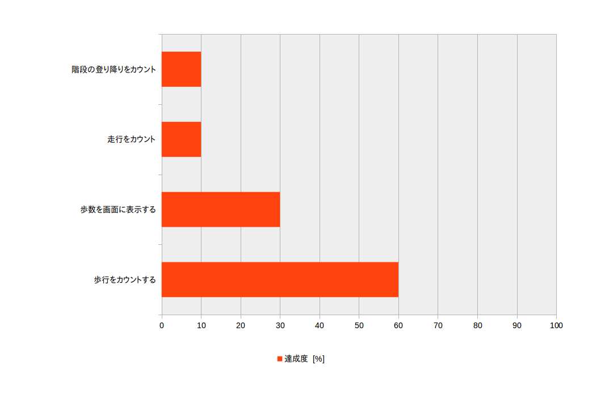

# ディジタル万歩計 Digital Pedmeter
## 中間プレゼンテーション - 2017/12/13

- 154-T6901 早﨑悠登
- 151-T6908 平松将
- 150-T6909 廣松大祐
- 151-T6942 山崎雄喜

---
# 目標　（再掲）
以下の目標について精度80%の正確さを目指す
1) 歩行をカウント
2) 走行をカウント
3) 階段の登り降りをカウント
4) 歩行以外（手で振るなど）をカウントしない

---
# 方針　（再掲）
### 1.歩行データから規則性を調べる
1) データをとる
2) 平滑する（n点平均をとる）
3) 歩数をカウント出来る特徴を見つける   ← 現在
### 2.歩数をカウント出来る特徴を取り出すプログラムを作成する
### 3.調整

---
# 開発計画　（再掲）
##### 1.歩行データをArduinoで取得し、歩行時のデータ的特徴を読み取る
##### 2.データを元にPCでプログラムを作成
1) 適切な長さの配列にデータを格納
2) 平滑化処理
3) カウントする
##### 3.Arduinoに移植
##### 4.走行、階段の昇降についても1~4を繰り返す
##### 5.（追加機能）
1) 画面表示、リセットボタン
2) 移動距離
3) 消費カロリー
4) 検知した足踏みに合わせて音を鳴らす 

---
# 進捗報告

---
# 開発進捗
## 1. Zigbeeとモバイルバッテリーを使うことで、PCと万歩計を切り離してデータを取得することが可能となった

## 2. 取得したデータを解析し、加速度センサーのx,y,zの特性の違いを確認
## 3. この結果から特にzの値を使ってカウントするプログラムを作成中

---
# 万歩計
 

---

---
# 図2 x,y,z 特性グラフ 歩行時（30歩）

---
# 進捗グラフ

---
# 今後の課題
1. 手を振ったときなど、歩行以外の動作と歩行をどう区別するか
2. Zigbeeから得た加速度センサーのデータが、プログラムのサンプリングレートより荒くなっている原因の究明
3. 歩数をカウントするプログラムを完成させArduinoに移植すること

---
# ご静聴ありがとうございました

